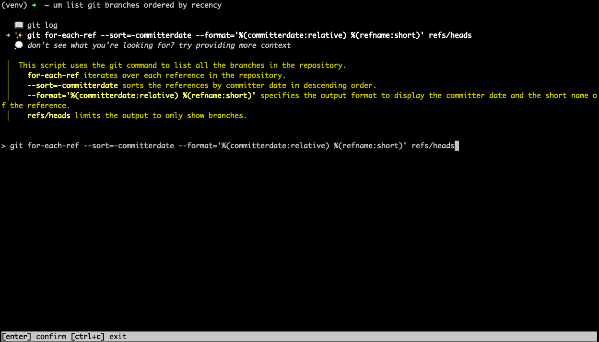
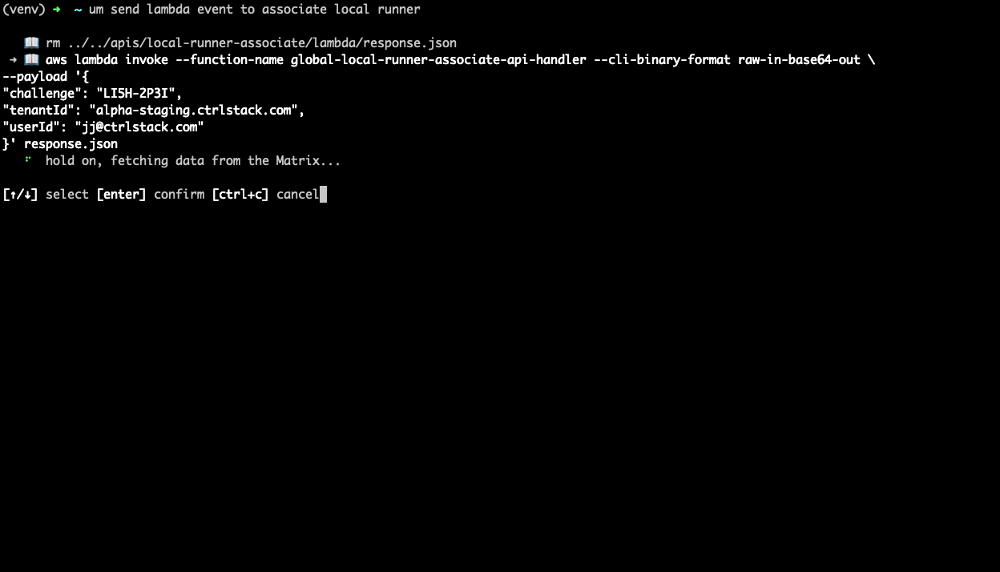
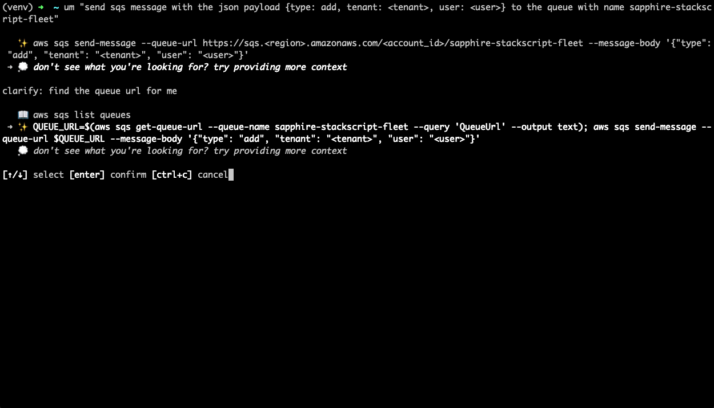

`um` is a GPT-powered CLI assistant. Ask questions in plain English, get the perfect shell command.



# Features

- find the right command without leaving the terminal
- `um` can index your history to find commands you've run before
- `um` instantly learns from your corrections
- simple interface to clarify your question or provide more context
- free to use

# Installation

## pip (preferred)

Make sure you have python 3.10 or more recent

```shell
pip3 install git+https://github.com/promptops/cli.git
```

## homebrew (MacOS only)

```shell
brew install promptops/promptops/promptops-cli
```

# Usage

## um

```shell
um <question>
```

## local runner

```shell
promptops runner
```

# Examples

```shell
um list contents of tar file
um upload file to s3
```

## More screenshots

Semantic search in history



Provide more context flow



# Development setup

create virtual env

```shell
python3 -m venv ./venv
. ./venv/bin/activate
```

install dependencies

```shell
pip install -r requirements.txt
```

install the cli

```shell
make install
```

test with

```shell
um get pods
```
